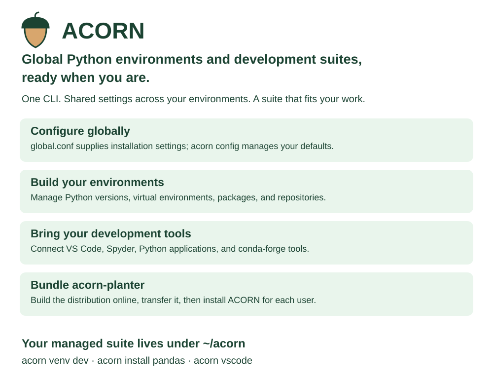
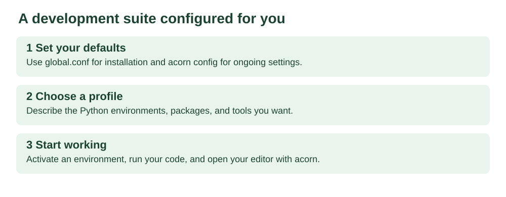
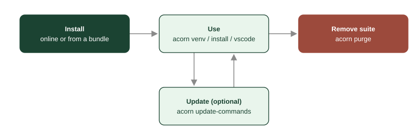

# ACORN Planter

[](https://github.com/jrvannucci/acorn-planter/actions/workflows/ci.yml)

**Global Python environments and development suites, ready when you are.**

ACORN gives you one place to configure and manage your Python interpreters,
virtual environments, packages, repositories, and development tools. Shared
settings apply across your environments, while profiles assemble the suite
that fits your work. Install online or bring a complete bundle to an offline
network.

**Build the planter. Distribute the planter. Use ACORN.**

The offline builder bundles **`acorn-planter`** with its installers,
configuration, profiles, and the resources needed for offline installation.
The administrator transfers this prepared distribution to the target network.
Users run its installer to create their own **`acorn`** development suite.

`acorn-planter` is the distribution repository or folder. `acorn` is the
installed Python package and CLI, with a default user directory of `~/acorn`.
The bundle archive contains a self-contained `acorn-planter/`: its wheels,
Python builds, conda channel, and manifest live inside that folder. Resource
paths in `acorn-planter/global.conf` can point elsewhere when needed.

The repository and extracted offline bundle use the same layout:

```text
GET_STARTED/                  user installation and removal launchers
GET_STARTED_OFFLINE_BUNDLE/    administrator build launchers
acorn-planter/                 master configuration, profiles and resources
  global.conf
  offline-bundle.toml
  installation-profile/
  src/acorn/
  installers/
  examples/
```

Run `GET_STARTED_OFFLINE_BUNDLE/offline-bundler.cmd` to build the distribution.
Transfer the complete output, including both launcher folders. Users run
`GET_STARTED/install.cmd`; their personal suite is installed into `~/acorn`.
The shared wheelhouse and interpreter archives remain in the planter.



---

## Your development suite



- **Global defaults for your environments.** Configure installation with
  `global.conf`, then manage your settings with `acorn config`.
- **Python versions and packages together.** Create environments for different
  projects and keep their dependencies separate.
- **Development tools within reach.** Open VS Code or Spyder against the
  environment you are using.
- **Online and offline installation.** Prepare a bundle of resources and
  validate profiles before taking your suite to an offline network.

Profiles let you describe a repeatable setup for yourself or use one supplied
by your administrator. Your managed environments and tools live under `~/acorn`.

---

## Install

Nothing needs to be pre-installed — not Python, not uv, nothing.

**macOS / Linux:**
```sh
curl -fsSL https://raw.githubusercontent.com/jrvannucci/acorn-planter/main/acorn-planter/installers/install.sh | sh
```

**Windows (PowerShell):**
```powershell
irm https://raw.githubusercontent.com/jrvannucci/acorn-planter/main/acorn-planter/installers/install.ps1 | iex
```


> On Windows you can also download the repo and double-click `GET_STARTED/install.cmd`.
> Skip the ready-made environment with `ACORN_AUTO_SETUP=false`.
>
> **Given a profile by your admin?** Point the same one-liner at it and you get
> their exact environment in one step:
> `curl -fsSL ... | ACORN_PROFILE=./team.toml sh`. See
> [deployment profiles](docs/PROFILES.md).

---

## The everyday workflow

Open a new terminal. You're already in a working environment, so the loop is
short:

```sh
python                     # the newest Python, in a venv, ready
acorn install requests      # add packages to the environment you're in
acorn venv myproject        # a separate environment for a separate project
acorn activate myproject    # switch to it (new terminals remember the default)
acorn run -- pytest         # run something in a venv without switching
```

That's the whole day-to-day. The rest is there when you need it: `acorn vscode`
opens the bundled editor, `acorn repo-clone <url>` pulls a project into
`~/acorn/repo`, `acorn summary` shows everything installed, and
`acorn health-check` verifies it.

Names are predictable: a bare noun does the thing (`python` installs, `venv`
creates), `noun-list` shows them, and **anything that deletes is `remove-*`**.

🔎 **[Browse every command](docs/COMMANDS.md)** — all 59 in one filterable
list; click any one to open its full documentation.

### It changes only when you ask



acorn runs from its own private copy of the source in `~/acorn`. New
commits upstream change nothing until you run `acorn update-commands`. When
you're done with it, `acorn purge` removes the folder and the shell hook.

---

## For organizations 🏢

acorn is also built to be **deployed** — by one person, to everyone else,
including on networks where the usual Python setup path doesn't work at all.

- **No internet, no admin rights.** Point installs at a self-hosted git
  server, an internal index, or a plain file share. For a fully disconnected
  network, `GET_STARTED_OFFLINE_BUNDLE/offline-bundler.cmd` assembles the whole bundle — uv,
  interpreters, wheels, the editor — on a connected machine.
- **Nothing for your users to configure.** Set the values once in
  [`global.conf`](acorn-planter/global.conf) in the copy you distribute; everyone who
  installs from it inherits them.
- **One folder defines the environments.** Each profile in
  `installation-profile/` lists the interpreters, venvs, packages and repos a
  group should end up with, and says who gets it — one for everyone, others
  opt-in by name.
- **Auditable and reversible.** Every command is logged in plain text,
  downloads are checksum-verified, `--preview` shows what a removal would
  delete, and nothing third-party is vendored — each bundle carries a
  `MANIFEST.json` naming every component and its licence, down to each
  individual wheel.

📘 Start with the **[deployment guide](docs/DEPLOYMENT.md)**, or
**[offline networks](docs/OFFLINE.md)** for a disconnected fleet.

---

## Documentation

| | |
|---|---|
| [Using acorn](docs/GUIDE.md) | Installing, the folder layout, the update model, troubleshooting |
| [Command reference](docs/COMMANDS.md) | Every command and flag |
| [Design and safety](docs/DESIGN.md) | Why deletion is defensive, what's logged, how downloads are verified |
| [Deployment guide](docs/DEPLOYMENT.md) | `global.conf`, shared machines, rollout, security review |
| [Deployment profiles](docs/PROFILES.md) | The file describing what users end up with, and who gets it |
| [Profile examples](docs/PROFILE-EXAMPLES.md) | Complete profiles: research group, software team, classroom, air-gapped fleet |
| [Custom commands](docs/CUSTOM-COMMANDS.md) | Add your organization's own verbs to `acorn` |
| [Offline networks](docs/OFFLINE.md) | Running with no internet at all |
| [Licensing](docs/LICENSING.md) | What acorn downloads, and under what terms |

🗺️ Not sure where to look? The [documentation map](docs/DOCUMENTATION.md)
routes you from what you're trying to do to the right page.

**Working on acorn itself?** The
[contributor guide](docs/CONTRIBUTING.md) covers the edit →
`acorn update-commands` loop, the source layout, and the tests (`uvx pytest`
from the repo root).

---

## License

Apache 2.0. acorn has no third-party runtime dependencies and bundles no
third-party software; the tools it downloads for you come from their
publishers under their own licenses — see
[THIRD-PARTY-NOTICES](THIRD-PARTY-NOTICES.md) and, for what you may
redistribute in an offline bundle, [docs/LICENSING.md](docs/LICENSING.md).
