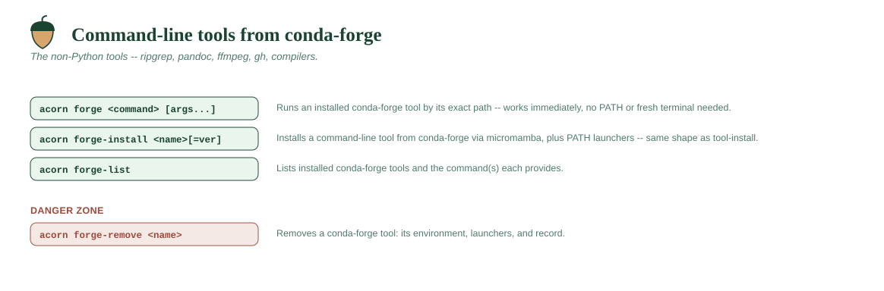

# Command-line tools from conda-forge



## `acorn forge <command> [args...]`

Runs an installed conda-forge tool **without needing it on PATH or a fresh
terminal** — `acorn forge gh pr create`, `acorn forge rg TODO`. acorn runs the
tool by its exact path (via `micromamba run`), inheriting your terminal, so
interactive prompts, colour, and pagers all behave normally, and the tool's
own exit code is passed back.

This is the convenient, always-works counterpart to the PATH launchers: the
launchers let *other* programs and scripts find `gh`/`rg` by bare name and are
nice for heavy interactive use, but they need a new terminal (and a shell that
has acorn's hook). `acorn forge <command>` works the moment the tool is
installed.

Everything after the command name is passed straight through untouched. Run
`acorn forge` with no arguments to list the available commands.

```
acorn forge gh auth login
acorn forge rg "def install" src
```

## `acorn forge-install <name>[=version]`

Installs a **command-line tool from conda-forge** — the things that aren't
Python packages and so aren't `acorn install`-able: `ripgrep`, `pandoc`,
`ffmpeg`, `gh`, compilers, and so on.

This is acorn's *second* engine. `acorn install` is uv (the PyPI world);
`acorn forge-install` is [micromamba](https://mamba.readthedocs.io), fetched
once into `system/bin` the first time you use it (or dropped there as a
vendored binary for an offline install). Each tool gets its own isolated
environment, and acorn writes a small launcher for every command the tool
provides into a directory the shell hook puts on your PATH — so the tool runs
as a bare command in a new terminal.

Packages come from **conda-forge only** — the community channel, which is
distinct from Anaconda's `defaults` and its commercial terms (see
[Licensing](../LICENSING.md)). Point `conda_channel` at an internal mirror or a
local directory for a proxied or air-gapped network.

- Pin a version with `=`: `acorn forge-install ripgrep=14.1.0`.
- The command name is often not the package name (installing `ripgrep` gives
  you `rg`); acorn prints what it exposed.
- Open a new terminal afterward so the tool is on PATH.

```
acorn forge-install ripgrep
acorn forge-install pandoc=3.2
```

## `acorn forge-list`

Lists the conda-forge tools you've installed and the command(s) each provides.

```
acorn forge-list
```
```
conda-forge tools:
  ripgrep  ->  rg   (ripgrep)
  pandoc   ->  pandoc   (pandoc=3.2)
```

## `acorn forge-remove <name> [-y]`

Removes a conda-forge tool: its environment, its PATH launchers, and its
record. Prompts for confirmation first (skippable with `-y`/`--yes`), like
every other `remove-*` command, and supports `--preview` to see exactly what
would go without touching anything.

```
acorn forge-remove ripgrep
acorn forge-remove ripgrep --preview
acorn forge-remove ripgrep -y
```
