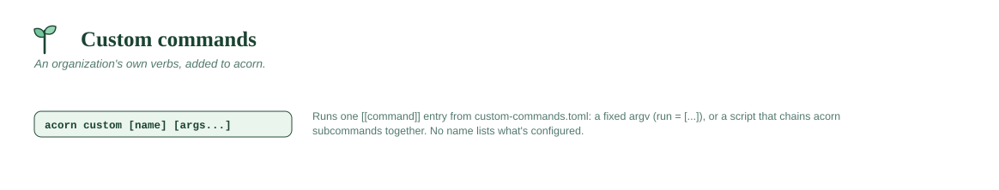

# Custom commands



## `acorn custom [name] [args...]`

Runs an organization's own **custom command** — full details, including how
to define one, are in **[CUSTOM-COMMANDS.md](../CUSTOM-COMMANDS.md)**.

Every command is one `[[command]]` entry in `custom-commands.toml`: either
`run = [...]` (a fixed argv, an optional venv) for the simple case, or
`script = "..."` (a `.py`/`.sh`/`.ps1` file next to the TOML file) for
anything that needs real logic or to chain several `acorn` subcommands
together — a script orchestrates by shelling out to `acorn` itself, the same
thing `acorn apply` already does internally, so there's no special API to
learn.

Everything after the command's own name is passed straight through. Run
`acorn custom` with no arguments to list what's configured. A command can
also opt into running as bare `acorn <name>` — see
[Making a command top-level](../CUSTOM-COMMANDS.md#making-a-command-top-level);
a built-in `acorn` command always wins any name collision.

```
acorn custom lint
acorn custom lint --fix
acorn custom
```

A configured `startup_commands` list runs these same commands automatically
in every new shell — see [CUSTOM-COMMANDS.md#running-commands-at-
startup](../CUSTOM-COMMANDS.md#running-commands-at-startup).
