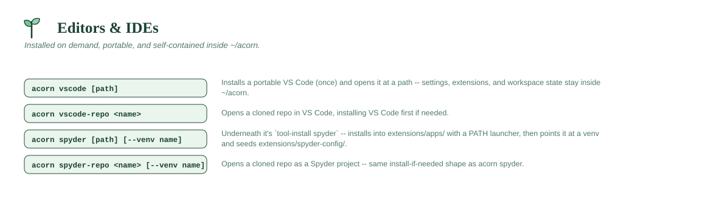

# Editors & IDEs



## `acorn vscode [path] [--reinstall] [--no-open] [-y]`

Opens VS Code at `path` (defaults to the current directory), installing a
fully portable copy into `~/acorn/extensions/vscode/app` first if none
exists — though a default install already did that up front (see
`ACORN_AUTO_VSCODE` in `global.conf`), so normally this just opens.
`--no-open` installs/verifies without opening a window (what the
installer's default setup uses).

- **The first-time install asks first.** With nothing installed yet, this
  command would otherwise pull ~300 MB without warning, which is expensive
  on a metered or locked-down connection. It prints the size and prompts;
  declining exits 0 and tells you how to install later. Once VS Code *is*
  installed there is no prompt — opening stays instant.
- `-y`/`--yes` (or `ACORN_YES=1`) skips that prompt, and
  `--non-interactive` (or `ACORN_NONINTERACTIVE=1`) skips the install
  rather than waiting for input. `--reinstall` is exempt: asking for a
  reinstall already says you want the download.
- `acorn vscode-repo` shares the same gate and the same flags, since it can
  trigger the same first-time download.

- **Portable mode:** a `data/` folder is created next to the VS Code
  executable, which makes VS Code keep all settings, extension installs,
  and workspace state inside that same folder — nothing goes to
  `~/.vscode`, `~/Library/Application Support`, or `%APPDATA%`.
- **Default settings** written on first install
  (`data/user-data/User/settings.json`):
  - `editor.formatOnSave: true`, default formatter set to Ruff
  - `notebook.formatOnSave.enabled: true`
  - `python.terminal.activateEnvironment: true`
  - `python.analysis.typeCheckingMode: "basic"`
  - `files.autoSave: "onFocusChange"`
  - `python.venvPath` set to `~/acorn/python/venvs`, so every `acorn venv`
    shows up in VS Code's interpreter picker automatically
  - Telemetry, auto-update, and extension auto-update all turned off
- **Default extensions** installed on first install:
  - `ms-python.python`, `ms-python.vscode-pylance`, `ms-python.debugpy`
    (Python language support + debugging)
  - `ms-toolsai.jupyter`, `ms-toolsai.jupyter-keymap`,
    `ms-toolsai.jupyter-renderers` (Jupyter notebooks)
  - `charliermarsh.ruff` (fast linting/formatting)
  - `editorconfig.editorconfig`
  - `mechatroner.rainbow-csv` (color-codes CSV/TSV columns by position, plus
    a simple SQL-like query feature over the file)
- `--reinstall` forces a fresh download/reinstall even if VS Code is
  already present.
- **Uses VS Code's actual CLI entry point** (`bin/code.cmd` on Windows,
  `Contents/Resources/app/bin/code` on macOS, `bin/code` on Linux) for both
  installing extensions and opening windows — the same thing that runs
  when you type `code --install-extension ...` or `code .` in a normal
  terminal, rather than the raw Electron GUI binary (which would open a
  full window per extension and flood stdout/stderr with log spam). If the
  CLI script genuinely can't be found, extension installation is skipped
  with a warning rather than falling back to that behavior.
- All subprocess calls (extension installs, opening a window) run with
  stdout/stderr/stdin redirected away from your terminal, and the window-
  open call is fully detached from acorn's own process — `acorn vscode`
  returns immediately either way and never blocks on VS Code's own output.
- Idempotent: a plain `acorn vscode` with no `--reinstall` only ever
  downloads/reinstalls/re-adds extensions on the very first run for a given
  `~/acorn`; every call after that just opens a window.
- Platform support: downloads the correct stable-build archive for
  Windows (`win32-x64-archive`), macOS (`darwin` / `darwin-arm64`), and
  Linux (`linux-x64` / `linux-arm64`) automatically.

```
acorn vscode
acorn vscode ./my-project
acorn vscode --reinstall
```

## `acorn vscode-repo <name> [-y]`

Opens a cloned repo in VS Code — installing VS Code first if it isn't
already (same one-time setup as `acorn vscode`). Shares the same CLI-entry-
point, detached-process opening logic as `acorn vscode`, and the same
first-time download prompt (with the same `-y` / `--non-interactive`
flags) — reaching the editor from a repo shouldn't cost 300 MB any more
quietly than reaching it directly.

```
acorn vscode-repo some-project
```

## `acorn spyder [path] [--venv <name>] [--no-open] [-y] [--non-interactive]`

Installs (once) and opens **Spyder**, the scientific Python IDE — the
variable explorer, IPython console and plots pane that people coming from
MATLAB or R usually want. Same shape as `acorn vscode`, and it asks before
its first-time ~200 MB download in exactly the same way.

`-y`/`--yes` skips the first-run "install this ~200 MB?" prompt;
`--non-interactive` (or `ACORN_NONINTERACTIVE=1`) refuses to prompt at
all and aborts instead — the same two shared confirmation knobs every
consequential-but-not-destructive prompt in acorn honors (see
[Non-interactive mode & previews](../DESIGN.md#non-interactive-mode--previews)).

Underneath it's `acorn tool-install spyder`, but the command exists because
three things have to be arranged that a plain application install can't
know about:

- **Its settings stay inside acorn.** Spyder would otherwise write to
  `~/.config/spyder-6` or `%APPDATA%`; acorn points it at
  `~/acorn/extensions/spyder-config` (`--conf-dir`), so `acorn purge`
  still leaves nothing behind.
- **It's pointed at a venv.** Unlike VS Code, whose Python extension
  discovers environments itself, Spyder has to be told. acorn writes the
  interpreter into its `spyder.ini`, **merging** rather than overwriting, so
  your own Spyder settings survive.
- **`spyder-kernels` is installed into that venv**, pinned to the minor
  series matching the installed Spyder (read from Spyder's own environment,
  never hardcoded). Without a compatible version, Spyder's console refuses
  to connect — the classic Spyder failure.

### Which venv it uses

Most specific wins:

1. **`--venv <name>`** — when you say outright. Naming a venv that doesn't
   exist is an error, not a fall back to a different one.
2. **The venv active in this shell** (`VIRTUAL_ENV`) — so `acorn activate
   analysis && acorn spyder` gives you that environment, the same way
   `acorn install` targets it. Any active venv counts, acorn-managed or
   not.
3. **`default_venv`** — so it still works from a shell with nothing
   activated.

Because the kernel is prepared *before* Spyder launches, switching venvs and
reopening switches the console with it. With nothing active and no default,
Spyder still opens but runs on its own interpreter and won't see your
packages; it says so.

> **Close Spyder before switching venvs.** A running instance won't pick up
> the new interpreter, and Spyder rewrites its own config on exit — so it can
> overwrite the setting acorn just wrote.

- Installing `spyder-kernels` may **downgrade `ipykernel`** in that venv:
  it requires `ipykernel<7`, and acorn's default venv packages install a
  newer one, so this happens on a stock venv. It's required for Spyder's
  console to work at all, and acorn says so explicitly when it happens —
  including that anything else in that venv (Jupyter, VS Code notebooks)
  gets the older version too. The cap is `spyder-kernels`', not Spyder's,
  and upstream is already relaxing it (3.2 raises it to `<7.3`); because
  acorn reads the required version from Spyder's own environment rather
  than pinning one, that fixes itself when it ships.

> **x86_64 only.** Spyder comes from PyPI, and PyQt5's Qt payload publishes
> no arm64 wheels — so this can't work on Apple Silicon or ARM Linux. There,
> use the conda-forge build instead: `acorn forge-install spyder`. `acorn
> spyder` says exactly that rather than failing with a dependency error.

```
acorn spyder                      # the active venv, else the default
acorn activate analysis
acorn spyder                      # now runs in 'analysis'
acorn spyder --venv scratch       # or name one outright
```

## `acorn spyder-repo <name> [--venv <name>] [-y] [--non-interactive]`

Opens a cloned repo as a **Spyder project** (`--project`), the natural
counterpart to `acorn vscode-repo`. Same install-if-needed behavior, the
same first-run prompt (and the same `-y`/`--non-interactive` knobs for it),
and the same [venv resolution](#which-venv-it-uses) as `acorn spyder` —
`--venv <name>` names one outright, otherwise the active venv or
`default_venv` is used.

```
acorn spyder-repo some-project
acorn spyder-repo some-project --venv analysis
```
