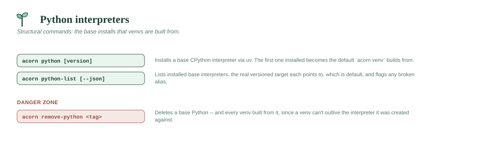

# Python interpreters

Structural commands: the base installs that venvs are built from. Most days
you never touch these after the first install.



## `acorn python [version]`

Installs a base CPython interpreter via `uv python install`, redirected
(via `UV_PYTHON_INSTALL_DIR`) into `~/acorn/python/base`. With no
version at all, installs the **newest stable Python** uv knows about and
derives the tag from what actually landed (e.g. `314`) — this is what the
installer's default-environment setup uses.

- Accepts `312`, `3.12`, or `3.12.4` — digits are extracted and normalized
  into a dotted version spec for uv, and a short tag (e.g. `312`) for the
  folder alias.
- After installing, acorn locates the real directory uv created and
  writes the `<tag>.alias.json` pointer file described above.
- The **first** base Python you install becomes the default used by
  `acorn venv` when you don't pass `--python`. This is tracked in
  `~/acorn/system/config/settings.json`.

```
acorn python 312
```

## `acorn python-list [--json]`

Lists every base Python interpreter installed via `acorn python`, showing
the short tag, the real versioned directory it points to, which one is the
default used by `acorn venv`, and flags any alias whose target directory has
gone missing (e.g. if it was deleted by hand). `--json` prints the same
data as machine-readable JSON instead — see
[Scripting & automation](scripting-and-automation.md).

```
acorn python-list
```
```
Base Python interpreters in ~/acorn/python/base:
  311      -> cpython-3.11.9-linux-x86_64-gnu
  312      -> cpython-3.12.4-linux-x86_64-gnu  (default for `acorn venv`)
```

## `acorn remove-python <tag> [-y] [--preview] [--non-interactive]`

Deletes a base Python **and every venv that was built from it** — venvs
can't function without the interpreter they were created against, so this
cascades rather than leaving them broken.

- Detects dependent venvs by reading the `home` field out of each venv's
  `pyvenv.cfg` and checking whether it resolves inside the base Python's
  directory.
- Lists exactly what it's about to delete (the base, plus each dependent
  venv by name) before asking for confirmation, unless `-y`/`--yes`.
  `--preview` shows the same list and exits without deleting anything;
  `--non-interactive` refuses to prompt and aborts instead of waiting — see
  [Non-interactive mode & previews](../DESIGN.md#non-interactive-mode--previews).
- Closes whatever turns out to be holding files open, escalating only as
  far as needed (see *How a removal frees locked files*) — so nothing blocks
  deletion.
- If the removed base was the default for `acorn venv`, automatically
  switches the default to another remaining base (or clears it if none are
  left).

```
acorn remove-python 311
```
