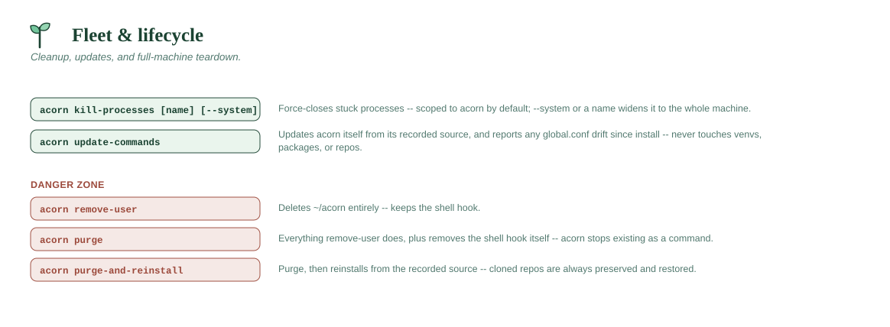

# Fleet & lifecycle



## `acorn kill-processes [name] [--system] [-y] [--preview] [--non-interactive]`

An escape hatch for stuck scripts or a frozen VS Code window. **Scoped to
acorn by default** — bare `acorn kill-processes` only force-closes
processes belonging to the acorn tree (decided by executable path,
command line, or working directory under `~/acorn`, never by name), on
the reasoning that "something of mine is stuck" shouldn't close a
colleague's editor or an unrelated job. Widening the blast radius takes an
explicit flag:

- `acorn kill-processes` (no arguments) — acorn's own processes only.
  Prompts for confirmation unless `-y`/`--yes`.
- `acorn kill-processes --system` — force-closes every process matching common
  Python interpreter names (`python`, `python3`, `python3.8`-`3.14`,
  `pythonw`) and VS Code/Electron process names (`code`, `Code`,
  `Code Helper*`, `Electron`) **on the whole machine**, acorn-started or
  not. Always prompts unless `-y`.
- `acorn kill-processes <name>` — force-closes every process with that
  **exact** name, machine-wide (e.g. `acorn kill-processes node`). On
  Windows, `.exe` is appended automatically if you don't include it. Always
  prompts unless `-y`.

`--preview` lists exactly what would be closed without closing anything;
`--non-interactive` refuses to prompt and aborts instead — see
[Non-interactive mode & previews](../DESIGN.md#non-interactive-mode--previews).

Implementation notes:
- Uses only OS-builtin tools: `pgrep -x` + `kill`/`os.kill` on macOS/Linux,
  `taskkill /F /IM` on Windows. No third-party dependency like `psutil`.
- Always excludes acorn's own running process (and its parent) from the
  kill list, so it can't terminate itself mid-cleanup — this matters
  because on macOS/Linux, `acorn-cli`'s own process image is literally a
  `python3.x` process (its shebang execs the interpreter directly).
- The underlying `kill_python_and_vscode()` helper (the `--system` sweep) is
  reused by `acorn remove-venv(-all)`, `acorn remove-python`, `acorn remove-repo`,
  `acorn remove-user`, and `acorn purge` — anything that deletes files is
  preceded by this same sweep, to avoid "file in use" failures.

```
acorn kill-processes                # just acorn's own stuck processes
acorn kill-processes --system
acorn kill-processes node -y
```

## `acorn update-commands`

The **only** thing that updates the `acorn` command itself after initial
install. See [The update model](../GUIDE.md#the-update-model) for the full
explanation. In short:

> **Not what you want if your venvs/packages/repos are out of date with a
> [deployment profile](../PROFILES.md)** — that's [`acorn apply`](status.md#acorn-apply-profile---preview---force),
> a completely separate command. This one only ever touches `acorn`'s own
> code; it never creates, installs, or removes anything `acorn apply`
> manages, and `acorn apply` never pulls a newer `acorn`.

- If the `update_source` setting holds a git URL, downloads a fresh
  shallow clone of it into a temp folder, swaps it in as the new
  `~/acorn/system/src` (minus its `.git`), then reinstalls via
  `uv tool install --force --reinstall`. Pass **`--from-branch <branch>`**
  to clone a specific branch or tag instead of the remote's default branch
  — useful for tracking a `dev`/`staging` line or pinning a release tag.
- If `update_source` holds a directory path, re-copies from it instead
  (same swap, same reinstall). `--from-branch` doesn't apply here (a
  directory has no branches) and is ignored with a note.
- If no source is recorded, it just reinstalls from whatever is currently
  in `~/acorn/system/src`, which doubles as a repair command if you've
  hand-edited something there. A failed download also falls back to this,
  never leaving you without a working `acorn`.

In every mode it finishes by re-rendering the `acorn` shell function
(`~/acorn/system/shell/acorn.ps1` / `acorn.sh`) from the refreshed
templates, so shell-side changes ship with updates too. Your profile hook
points at that file by path, so the refresh takes effect in new shells
automatically — nothing in your profile is touched.

**It also tells you if `global.conf` changed underneath you.** Settings
(`acorn config`'s values, like `package_index` or `venv_default_packages`)
are seeded from `global.conf` once, at install time, and never
re-applied automatically — an org changing a share path or an index later
previously left every existing machine silently out of sync, discoverable
only when something broke. After refreshing, this command re-reads the
(now current) `global.conf` and reports anything it now sets
differently than what's actually configured here, with the exact
`acorn config set` to apply it:

```
The organization's global.conf now sets these differently than what's
configured on this machine (settings are only ever seeded at install
time, never re-applied automatically):
  package_index: 'https://old.example/simple' -> 'https://new.example/simple'
    acorn config set package_index "https://new.example/simple"
```

Deliberately a **report, not an apply** — a value you set by hand with
`acorn config set` is a real customization, and this must never silently
overwrite it. `update_source`, `profile`, and `custom_commands` (file
paths an installer resolves relative to its own invocation, sometimes
copying) aren't covered by this check; those still need a person to
notice and re-run `acorn config set`.

Replacing a running CLI is inherently delicate on Windows (the reinstall
must delete the tool venv whose `python.exe` is executing the update, and
Windows refuses to delete running executables). `acorn update-commands`
handles this by *renaming* the live tool venv and `acorn-cli` shim aside
(allowed even while running), installing fresh, and sweeping the set-aside
copies on the next update. If the reinstall fails partway, the previous
copies are renamed back, so a failed update always leaves a working `acorn`.

```
acorn update-commands
acorn update-commands --from-branch dev     # track a branch (git-URL sources)
```

## `acorn remove-user [-y] [--preview] [--non-interactive]`

Deletes `~/acorn` in its entirety — every base Python, every venv, VS
Code and all its extensions/settings, every cloned repo, uv itself,
everything. Prompts for confirmation (`yes` typed exactly) unless
`-y`/`--yes` is passed; `--preview` shows what would be deleted without
deleting it; `--non-interactive` refuses to prompt and aborts instead —
see [Non-interactive mode & previews](../DESIGN.md#non-interactive-mode--previews).

Before deleting, it first force-closes every Python and VS Code process on
the machine (the same sweep as `acorn kill-processes --system`, with the same
self-exclusion so it can't kill `acorn-cli`'s own process mid-run). This
avoids the classic "file is in use" failure on Windows, and stray file
handles on any OS, from a running venv interpreter or an open VS Code
window blocking deletion of files inside `~/acorn`. Like
`kill-processes`, this is machine-wide, not acorn-scoped — the
confirmation prompt says so up front.

This does **not** remove the `acorn` shell function/hook from your shell
profile — use `acorn purge` (or `GET_STARTED/uninstall.cmd` --
`sh ./GET_STARTED/uninstall.cmd` on macOS/Linux) for that.

```
acorn remove-user
```

## `acorn purge [-y] [--preview] [--non-interactive]`

Supports the same `-y`/`--preview`/`--non-interactive` trio as
`acorn remove-user` (see
[Non-interactive mode & previews](../DESIGN.md#non-interactive-mode--previews)).
The full uninstall — everything `acorn remove-user` does, **plus** removes
the `acorn` shell hook from every shell profile it can find:
`~/.zshrc`, `~/.bashrc`, `~/.bash_profile`, `~/.profile`, and both the
PowerShell Core and Windows PowerShell profile locations (checked on every
OS, since PowerShell itself is cross-platform — harmless no-ops wherever
they don't exist).

After `acorn purge` finishes, `acorn` stops existing as a command entirely.
This is the same end state as running `GET_STARTED/uninstall.cmd` (or
`sh ./GET_STARTED/uninstall.cmd` on macOS/Linux), just reachable from inside `acorn` itself without needing
the original installer files around. Reports exactly which profile files
it edited.

**`--keep-repos`** moves `~/acorn/repo` out to a sibling folder
(`~/acorn-repo-backup`, or `-1`/`-2`/... if that already exists) before
deleting everything else, so your cloned repos survive the purge. Without
it, repos are deleted along with everything else — if you have cloned
repos and didn't pass the flag, the confirmation screen reminds you before
asking you to type `yes`, but there's a single confirmation gate either
way (no separate interactive question to answer differently).

Without `--keep-repos`, any leftover `~/acorn-repo-backup*` folder from a
*previous* `acorn purge --keep-repos` is deleted too — the flag means "keep
repos this time," so leaving it off means you're saying you don't want
them kept around at all, and stale backups from an earlier purge would
otherwise just accumulate in your home directory forever.

The interactive confirmation screen also points out the alternatives
before you commit: how to preserve repos (`--keep-repos`), the smaller
partial-removal commands (`remove-venv`, `remove-venv-all`, `remove-python`,
`remove-repo`, and `remove-user`, which keeps the shell hook), and the
reinstall instructions matched to how this copy was installed: the
public one-liners for a github.com install, "run the installer on the
share again" for a network-drive install, or "clone this URL" for a
self-hosted git install. The same instructions are printed again after a
successful purge — that's the last output `acorn` ever produces, so it's
the last chance to see them.

```
acorn purge
acorn purge --keep-repos
acorn purge -y --keep-repos
```

```
acorn purge
```

## `acorn purge-and-reinstall [-y]`

The wipe-and-start-fresh command: everything `acorn purge` does, then it
**reinstalls acorn** from the source the original install recorded (the
`update_source` setting — the git URL it was cloned from, or the directory it
was copied from). Use it to rebuild a corrupted install, or to reset every
base Python, venv, and package back to a clean slate in one step.

**Cloned repos are always preserved.** They're moved to safety before the
wipe (like `acorn purge --keep-repos`) and then **restored** into the freshly
reinstalled `~/acorn/repo`, so a reinstall never costs you your repos —
no flag needed.

How it works around a program not being able to delete-then-relaunch its own
executable: acorn-cli writes a small self-contained reinstall script to a temp
path *outside* `~/acorn` (so it survives the wipe), then does the purge.
The `acorn` **shell function** — still loaded in your terminal after acorn-cli
exits — waits for the wipe to finish and then runs that script in the
foreground, so you see the reinstall happen. Because this relies on the shell
function, an existing install must have picked up this version first (run
`acorn update-commands` once); a brand-new command needs the updated `acorn`
either way. Open a new terminal afterward to pick up the fresh environment.

If **no `update_source` is recorded** (uncommon — every install origin records
one; mainly if you cleared it with `acorn config unset update_source`), it asks
whether to reinstall from the public repo (`github.com/jrvannucci/acorn`) and
aborts *without deleting anything* if you decline — set a source first with
`acorn config set update_source <git-url-or-directory>`.

Reinstalling has exactly the same requirements as a first-time install from
the same source — this command adds none of its own. A **URL** source is
`git clone`d by the installer: on **Windows** that needs no pre-installed git
(the installer bootstraps a portable MinGit into `~/acorn/extensions/git`
first, the same copy `acorn repo-clone` uses), while on **macOS/Linux** git
must already be on your PATH (there's no official portable build to bootstrap
there). A **directory** source (e.g. a network share, the offline-install
path) is reinstalled from in place with no git and no network.

```
acorn purge-and-reinstall
acorn purge-and-reinstall --preview
acorn purge-and-reinstall -y
```
