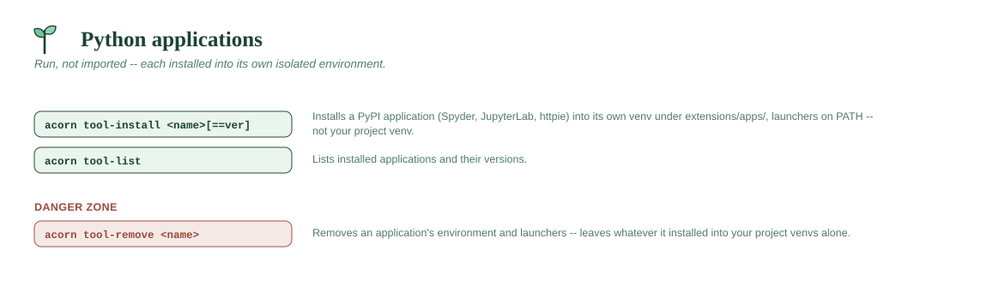

# Python applications



## `acorn tool-install <name>[==version] [--reinstall] [-y] [--non-interactive]`

Installs a **Python application from PyPI into its own isolated
environment** — Spyder, JupyterLab, httpie: things you *run* rather than
import, whose dependency trees you don't want inside a project venv.

Three commands install software, split by where it comes from:

| Command | Source | Lands in |
|---|---|---|
| `acorn install` | PyPI, **into the active venv** | that venv |
| `acorn tool-install` | PyPI, **its own venv** | `extensions/apps/<name>/` |
| `acorn forge-install` | conda-forge (not Python) | `system/conda/envs/<name>/` |

Backed by `uv tool install`, so the environment and the command launchers
are uv's own work; seedling just points it at the right directories and
keeps `package_index` / `ca_cert` applied, so this works on an internal
index or fully offline exactly like `acorn install`.

- Launchers land in `~/seedling/system/shims`, which the shell hook puts on
  PATH — open a new terminal to run them by name.
- Pin with `==`: `acorn tool-install spyder==6.1.5`.
- `--reinstall` forces a fresh install of something already present.
- `-y`/`--yes` skips the "install this now?" confirmation; `--non-interactive`
  refuses to prompt and aborts instead — see
  [Non-interactive mode & previews](../DESIGN.md#non-interactive-mode--previews).
- The app's environment is **separate from acorn-cli's own** (`system/tool`),
  so `uv tool` operations on your apps can never touch the running CLI.

```
acorn tool-install spyder
acorn tool-install jupyterlab
```

## `acorn tool-list`

Lists installed applications and their versions.

```
acorn tool-list
```
```
Applications in ~/seedling/extensions/apps:
  spyder  [6.1.5]
```

## `acorn tool-remove <name> [-y]`

Removes an application: its environment and its launchers. Supports
`--preview`. Uses `uv tool uninstall`, falling back to deleting the tree so
a half-installed app that uv no longer recognizes is still removable.

**It removes the application, not what the application put in your venvs.**
`acorn spyder`, for instance, installs `spyder-kernels` into whichever venv
it was pointed at; `acorn tool-remove spyder` leaves that alone. This is
deliberate — undoing it would mean a `remove-*` command reaching into a
venv to change packages you may now depend on, and in Spyder's case
deciding whether to restore the `ipykernel` version it had displaced.
Leaving one small, harmless package behind is the milder outcome. Remove it
yourself if you want to:

```
acorn activate myproject
acorn uninstall spyder-kernels
```

```
acorn tool-remove spyder
```
