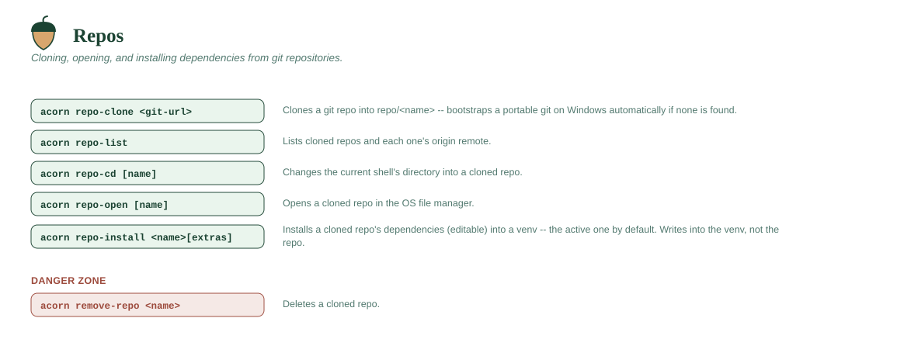

# Repos



## `acorn repo-clone <git-url>`

Clones a git repository into `~/seedling/repo/<name>` via `git clone`. The
repo name is derived from the URL (handles `https://host/group/name.git`,
SSH-style `git@host:group/name.git`, and plain paths).

**git itself:** on Windows, if no system `git` is found, seedling
automatically downloads a portable copy ("MinGit", Git for Windows'
official dependency-free build — no installer, no admin rights) into
`~/seedling/extensions/git` and uses that. This is the only piece of
seedling bootstrapped this way, because it's the only platform with a
genuinely portable official build; on macOS and Linux, git is dynamically
linked against system libraries, so there's no equivalent to safely bundle.
There, if git isn't found, you'll get a clear one-line instruction
(`xcode-select --install`/`brew install git` on macOS; your distro's package
manager on Linux) instead of a silent failure.

Fails with a clear message (rather than overwriting) if a repo with that
name already exists — remove it first with `acorn remove-repo`.

```
acorn repo-clone https://github.com/you/some-project.git
```

## `acorn repo-list`

Lists every repo cloned via `acorn repo-clone`, along with each one's
`origin` remote URL (if it's still a git checkout with one configured).

```
acorn repo-list
```
```
Repos in ~/seedling/repo:
  some-project  -> https://github.com/you/some-project.git
```

## `acorn repo-cd [name]`

Changes your **current shell's** directory to a cloned repo — the natural
follow-up to `acorn repo-clone`, and the quickest way to run git commands
(`git status`, `git pull`, `git push`) against it. With no name, takes you
to `~/seedling/repo` itself. Errors (without moving) if the repo doesn't
exist.

Like `acorn activate`, this only works through the `acorn` shell function —
a child process can't change its parent shell's directory — so the CLI
resolves and validates the path, and the function does the actual `cd`
(see [Why `acorn` is a shell function](../GUIDE.md#why-acorn-is-a-shell-function)).

```
acorn repo-cd myproject
acorn repo-cd
```

## `acorn repo-open [name]`

Opens a cloned repo in the **operating system's file manager** (Explorer
on Windows, Finder on macOS, your desktop's default elsewhere). With no
name, opens `~/seedling/repo` itself. For opening in VS Code, use
`acorn vscode-repo`.

```
acorn repo-open some-project
acorn repo-open
```

## `acorn repo-install <name>[extras] [--venv NAME]`

Installs a cloned repo's dependencies into a venv — the active one by
default, or the one you name:

- If the repo has a `pyproject.toml`, runs `uv pip install -e <repo>`
  (editable install — changes you make in the cloned repo take effect
  immediately without reinstalling, which is what you want when actively
  developing against it).
- Otherwise, if it has a `requirements.txt`, runs
  `uv pip install -r <repo>/requirements.txt`.
- If neither file exists, fails with a message rather than guessing.
- `name[extra,...]` selects the repo's optional dependencies, same spelling
  as a package spec: `acorn repo-install plotpress[gui]` installs
  `uv pip install -e <repo>[gui]`. Extras need a `pyproject.toml` to select
  from — asking for them on a `requirements.txt`-only repo is an error, not
  a silent plain install.
- `--venv NAME` (`-n`) installs into that venv whatever this shell has
  active, and fails if there's no such venv rather than falling back to
  another one. Without it, the same `VIRTUAL_ENV` warning as `acorn install`
  if nothing is active.

```
acorn activate myproject
acorn repo-install some-project
acorn repo-install some-project[gui]
acorn repo-install some-project[gui,dev] --venv analysis
```

A profile can declare the same thing for a fleet — see
[`[[repo]] install`](../PROFILES.md#reference).

## `acorn remove-repo <name> [-y] [--preview] [--non-interactive]`

Deletes a cloned repo from `~/seedling/repo`. Same process-closing
behavior as `acorn remove-venv` before deletion, and the same confirmation
prompt (skippable with `-y`), `--preview`, and `--non-interactive` — see
[Non-interactive mode & previews](../DESIGN.md#non-interactive-mode--previews).

```
acorn remove-repo some-project
```
