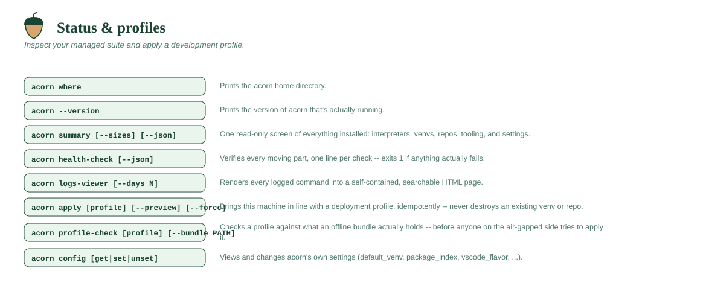

# Status & profiles



## `acorn where`

Prints the acorn home directory (`~/acorn`, or the value of the
`ACORN_HOME` environment variable override if set).

```
acorn where
```

## `acorn --version`

Prints the version of acorn that is actually running, as
`acorn <version>`. Worth quoting in any bug report — with
`acorn update-commands` in the picture, an install can be at a different
version than the share it was built from.

```
acorn --version
acorn -V
```

The version lives in exactly one place, `src/acorn/__init__.py`.
`acorn-planter/src/pyproject.toml` reads it from there (`dynamic = ["version"]`), so a
release is a one-line edit and the built distribution, the CLI, and the
grouped `acorn help` footer can never disagree.

## `acorn summary [--sizes] [--json]`

One read-only screen showing everything acorn has installed: uv/git/VS
Code status, every base Python (and which is default), every venv (its
Python version, which is active, which auto-activates in new shells),
every cloned repo with its origin remote, and all current settings.
`--sizes` also computes disk usage per item and a grand total (it walks
the whole tree, so it can take a few seconds on big installs).

```
acorn summary
acorn summary --sizes
acorn summary --json
```

`--json` prints the same facts as machine-readable data instead of a
rendered screen — for scripts, CI, and coding assistants that need to know
where things are without guessing. It writes nothing but JSON to stdout, so
it's safe to pipe.

The object carries a `schema` number (currently `1`); it's bumped when a
field changes meaning or goes away, never for a field that's merely added.
When acorn isn't installed yet, the object is just `schema`, `home`, and
`installed: false` — check `installed` before reading anything else.

Each venv reports a `python_executable`: the absolute path to that venv's
own interpreter, already resolved for the platform (`Scripts\python.exe` on
Windows, `bin/python` elsewhere). That's the field to use when something
needs to *run* the interpreter rather than describe it.

Size fields (`size_bytes` per item, `total_size_bytes`) are `null` unless
you pass `--sizes`, since computing them is the slow part.

```json5
{
  "schema": 1,
  "home": "C:\\Users\\alice\\acorn",
  "installed": true,
  "install_type": "single-user",     // or "multi-user"
  "shared_root": null,
  "tooling": {
    "uv":     { "version": "uv 0.7.19 (...)", "path": "..." },
    "git":    { "path": "..." },                    // null if not found
    "vscode": { "installed": false, "path": null, "size_bytes": null }
  },
  "pythons": [
    { "tag": "312", "target": "cpython-3.12.7-...", "path": "...",
      "default": true, "present": true, "size_bytes": null }
  ],
  "venvs": [
    { "name": "dev", "path": "...", "python_version": "3.12.7",
      "python_executable": "...\\python\\venvs\\dev\\Scripts\\python.exe",
      "active": true, "default": true, "size_bytes": null }
  ],
  "repos": [
    { "name": "myrepo", "path": "...", "remote": "https://...",
      "size_bytes": null }
  ],
  "settings": { "default_venv": "dev", "...": null },
  "total_size_bytes": null
}
```

## `acorn health-check [--json]`

The health check. Verifies each moving part and prints one line per check
with three columns: a **STATUS** (`OK` / `WARN` / `FAIL`), a cyan **AREA**
label saying what the check is about (`uv`, `git`, `config`, `python`,
`venv`, `updates`, `defaults`, `certs`, `offline`, `shell`, `logs`), and the
detail. It checks: uv actually runs, git is available, the config file
parses, every base Python alias resolves to a real interpreter, every venv
has its interpreter and its base Python still exists, the configured
defaults (`default_base`, `default_venv`) point at things that exist, the
`update_source` is recorded **and actually verified** — a git URL gets a
reachability probe (`git ls-remote`, 10-second timeout, prompt-proofed so it
can never hang asking for credentials), and a directory source must exist
and look like a acorn tree (an unmounted share is reported as exactly
that, not assumed to be a URL) — any offline `python_mirror`/`package_index` directories
and `ca_cert` bundle exist, the `acorn` shell hook is installed and not
stale (a hook line
pointing at a deleted file gets a loud warning), and the log directory is
writable.

`FAIL` means a core operation would not work right now and makes the
command exit 1 (useful in scripts/CI); `WARN` is informational (nothing
installed yet, no git, etc.) and doesn't affect the exit code.

```
acorn health-check
```

`--json` emits the same checks as data — `{schema, home, healthy, failures,
warnings, checks[]}`, each check being `{status, area, detail}`. The
rendering changes; the verdict doesn't, and the exit code is the same either
way.

## `acorn logs-viewer [--days N] [--no-open]`

Renders every logged `acorn` command (the daily plain-text files under
`~/acorn/system/logs/`) into a single **self-contained HTML page** and
opens it in your browser. The page is offline — no CDN, no network — so it
works on a closed network like everything else in acorn. It's a
**master-detail** view: a dense table on the left (**Date · Time · Status ·
Command · Duration**), and clicking a row shows that command's full output in
the pane on the right. Status is colour-coded from each command's recorded
exit code, and duration is computed from the start/finish timestamps. Above
the table are a search box (matches command *and* output), a **failures-only**
toggle, and an **interactive date-range picker** (All / Today / 7 days /
30 days presets, plus custom From/To date fields).

All embedded commands are filtered client-side, so changing the date range
is instant and needs no regeneration. `--days` still controls how much
history gets embedded in the first place (the picker can only reach within
what's loaded).

**The bootstrap installer is captured too**, into
`system/logs/install-<timestamp>.log`, shown in the viewer tagged **`setup`**
alongside your `acorn` commands — so a failed or surprising install is there
to inspect after the fact.

- **macOS/Linux (`install.sh`)** tees its *entire* run — every step and the
  output of the tools it invokes (uv, git, acorn-cli) — into the log, in the
  same block format as the daily logs (with a real exit code).
- **Windows (`install.ps1`)** records the console via `Start-Transcript`,
  which captures acorn's own `==>` narrative and the uv bootstrap, but
  **not** the raw output of native tools like `uv.exe`/`git` — on Windows
  PowerShell 5.1, redirecting a native command's stderr under
  `$ErrorActionPreference='Stop'` turns uv's normal progress into a fatal
  error, so the installer deliberately doesn't do that. The individual
  `acorn python` / `acorn venv` setup steps still appear as their own entries
  (they log themselves); the VS Code step runs as a background job during
  install (overlapping the Python setup for speed), so its output shows up
  inside the install log rather than as a separate entry. The installer ends
  its log with an explicit `acorn install completed (exit code 0)` /
  `FAILED (exit code 1)` marker, which is where the viewer's green/red
  status badge for the install comes from. (The transcript is UTF-16; the
  viewer detects that automatically.)

The page is written to `~/acorn/system/logs/logs-viewer.html` and
regenerated on every run.

- `--days N` — only include the last N days of logs (default: all, up to the
  30-day retention window runlog keeps).
- `--no-open` — write the HTML file but don't launch a browser (prints the
  path; useful over SSH / on a headless box).

```
acorn logs-viewer
acorn logs-viewer --days 7
```

## `acorn apply [profile] [--preview] [--force]`

Brings this machine in line with a [deployment profile](../PROFILES.md) — the
interpreters, named venvs and their packages, repos, and settings an
organization has standardized on.

> **Not what you want if `acorn` itself is out of date** — that's
> [`acorn update-commands`](lifecycle.md#acorn-update-commands), a completely separate
> command. This one only ever touches your environment (interpreters,
> venvs, packages, repos); it never changes `acorn`'s own code, and
> `update-commands` never touches any of what this one manages.

- With no path, uses whatever the `profile` setting records — a single file,
  or the **folder** a fleet distributes, in which case every profile in it
  that this user is given is applied: the `default = true` one first, then
  each profile listing them. Falls back to `profile.toml` in the current
  directory.
- Applying several is as safe as applying one twice — every step is
  create-if-missing — and stops at the first failure, since a later profile
  may layer on what an earlier one was meant to create.
- **Idempotent.** Applying twice changes nothing the second time, which is
  what makes it usable both as the install-time provisioning step and as the
  way a fleet picks up later changes to the standard.
- **Never destroys.** An existing venv is left exactly as it is. `--force`
  installs the profile's *missing* packages into it; nothing is ever removed
  or recreated. Deleting is `acorn remove-venv`, run on purpose. An existing
  clone is likewise never pulled, only cloned when absent — though a repo the
  profile installs is installed again into any of its venvs that doesn't have
  it, so rebuilding a venv brings the repo back with it.
- **Settings are the exception**: a key in the profile's `[config]`, and the
  default venv, are rewritten whenever this machine's value differs. See
  [what apply will and won't do](../PROFILES.md#what-apply-will-and-wont-do)
  for the full per-declaration table.
- `--preview` prints the plan and exits without changing anything.
- Exit codes: `0` applied or already current, `1` a step failed (it names
  which), `2` the profile itself is invalid.

Every step is an ordinary `acorn` command underneath (`python`, `venv`,
`install`, `repo-clone`, `repo-install`, `config set`), so a profile can only
do what you could have done by hand.

```
acorn apply --preview
acorn apply
acorn apply ./team-profile.toml --force
```

---

## `acorn profile-check [profile] [--bundle PATH]`

Checks whether a profile can actually be applied from an
[offline bundle](../OFFLINE.md) — **before** anyone tries it. Written for the
air-gapped side, where a profile is often authored months after the bundle
was carried in and there's no way to find out what the share holds short of
applying it and watching it fail.

- Checks the profile's interpreters, packages (including exact `==` pins),
  conda-forge tools, editors, and repos with their extras against what the
  bundle **actually contains** — the real wheelhouse, interpreter mirror,
  conda channel and staged editor, not what anyone intended to build.
- With no path, uses the same profile `acorn apply` would.
- The bundle is found automatically when `package_index` is a directory of
  wheels inside one (which is what an install from a bundle records). Pass
  `--bundle S:\tools` otherwise.
- Reports **every** problem at once, not just the first — the round trip to
  fix one is a walk to a locked room.
- Reads only; nothing is installed or changed. No network.
- Exit codes: `0` applies cleanly, `1` the bundle can't satisfy it (each
  reason is named), `2` the profile itself is invalid.

```
acorn profile-check ./new-team.toml
```

The connected-machine half of the same check runs inside `offline-bundler`,
against [`offline-bundle.toml`](../OFFLINE.md#offline-bundletoml--what-the-share-contains).

---

## `acorn config [get <key> | set <key> <value> | unset <key>]`

Views and changes acorn's own settings, stored in
`~/acorn/system/config/settings.json`. Bare `acorn config` lists every
setting with its current value and an explanation. The keys:

- `default_base` — the base Python tag `acorn venv` builds from when
  `--python` isn't given. Set automatically by your first `acorn python`.
- `default_venv` — a venv name that **every new shell auto-activates** on
  startup. Unset means no auto-activation. (Existing shells are
  unaffected; open a new terminal to see it.)
- `auto_activate` — whether new shells auto-activate `default_venv`
  (true/false, default true). Toggle with
  [`acorn auto-activate True|False`](venvs-and-packages.md#acorn-auto-activate-truefalse); when
  false, the default venv stays set but isn't activated automatically.
- `update_source` — where `acorn update-commands` gets acorn's own
  source: a git URL (works with self-hosted GitHub/GitLab on isolated
  networks) *or* a plain directory path (e.g. a network drive holding a
  copy of the repo, for machines with no git hosting at all). Recorded
  automatically at install time; unset means updates can only reinstall
  the existing copy.
- `venv_default_packages` — the packages installed into every new venv
  (default: `ipython, ruff, ipykernel`). Takes comma-separated input.
- `python_mirror` / `package_index` — offline sources for interpreters
  and packages (a URL, or a plain directory on a share). Normally seeded
  from `global.conf` at install time; see [OFFLINE.md](../OFFLINE.md).
- `conda_channel` — where `acorn forge-install` fetches conda-forge
  command-line tools from (default: `conda-forge`). A URL or local
  directory for an internal mirror or an offline network.
- `shared_root` — the directory holding per-user acorn homes, recorded
  automatically when `ACORN_HOME_DIR` used a `{user}` token. Only set on
  shared multi-user installs; enables the `admin-*` commands.
- `native_tls` / `ca_cert` — HTTPS trust for corporate-CA internal hosts:
  the OS trust store, or a PEM bundle (normally installed automatically
  from `vendor/certs/`). Applied to uv, git, and acorn's own downloads
  on every command.
- `profile` — the [deployment profile](../PROFILES.md) `acorn apply` uses when
  given no path. Recorded at install time from `ACORN_PROFILE`.
- `custom_commands` — path to the TOML file declaring your organization's
  own [custom commands](../CUSTOM-COMMANDS.md). Recorded at install time from
  `ACORN_CUSTOM_COMMANDS`.
- `startup_commands` — custom command names run automatically, in order, by
  every new shell (list; takes comma-separated input, `&&` chains names
  within one entry so a failure stops just that chain). Recorded at install
  time from `ACORN_STARTUP_COMMANDS`. See [CUSTOM-COMMANDS.md#running-
  commands-at-startup](../CUSTOM-COMMANDS.md#running-commands-at-startup).
- `vscode_flavor` — which editor build `acorn vscode` installs:
  `microsoft` (default) or `vscodium`. Affects the **next** install; use
  `acorn vscode --reinstall` to switch an existing one.
- `extension_gallery` — the extension registry base URL, when it shouldn't
  be the flavor's own default (e.g. an internal Open VSX mirror).
- `vscode_extensions` — the extensions installed into a fresh editor.
  Takes comma-separated input; an empty list installs none. Unset means
  the starter kit for the configured flavor.
- `vscode_config_dir` — a folder holding your own `settings.json`
  and/or `keybindings.json` to acorn into a fresh editor. `settings.json` is
  merged over the built-in defaults (your values win); `keybindings.json`
  is copied in as-is. Both apply only the first time, never overwriting a
  file a user already edited.

The four editor settings are usually deployment-wide rather than personal;
see [the deployment guide](../DEPLOYMENT.md#which-vs-code-build)
for what they're for and the licensing tradeoff they encode.

`acorn config get <key>` prints just the value (nothing at all when unset),
so it's script-friendly. `unset` resets a key to its built-in default.

```
acorn config
acorn config set default_venv myproject
acorn config set update_source https://github.mycompany.com/tools/acorn.git
acorn config set update_source "S:\shared\acorn"
acorn config set venv_default_packages "ipython,ruff,requests"
acorn config set vscode_flavor vscodium
acorn config set vscode_extensions "ms-python.python,charliermarsh.ruff"
acorn config unset default_venv
```
